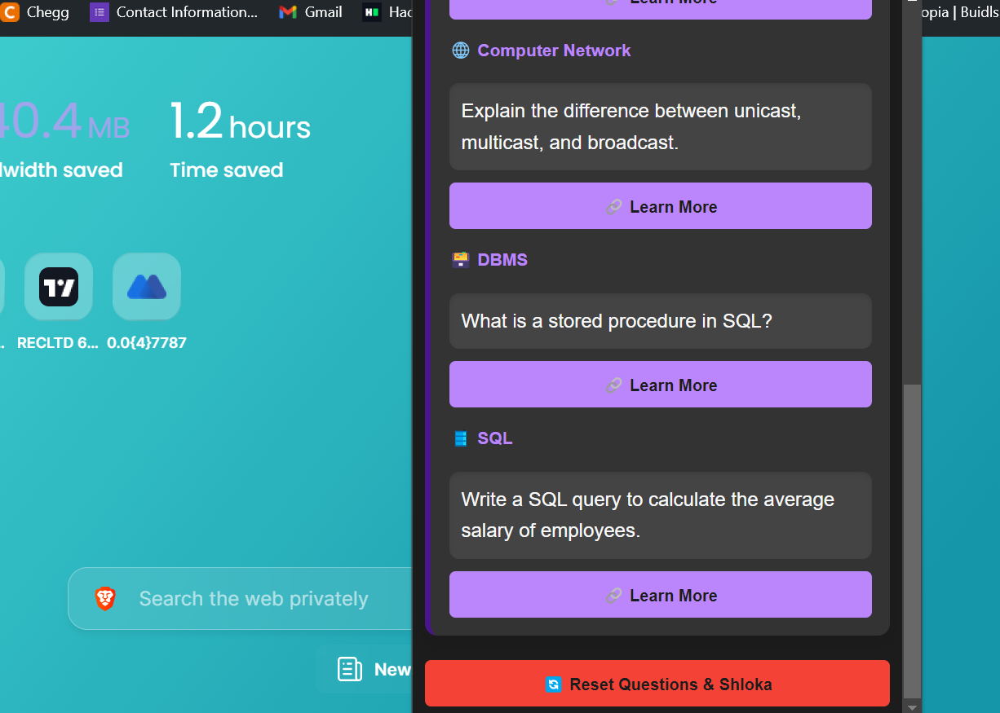
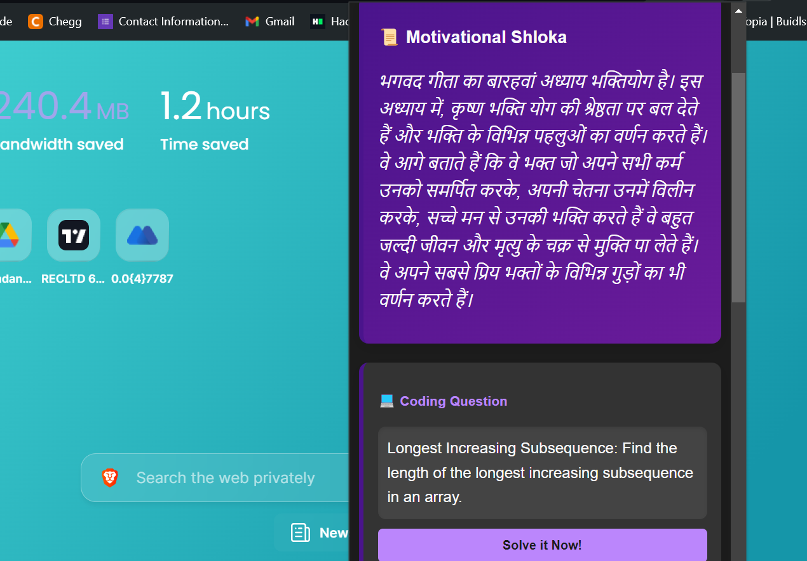

# Rise & Code 🌅💻

**Rise & Code** is a Chrome extension designed to kickstart your day with motivation and technical challenges. Each morning, you'll receive a motivational shloka from the Bhagavad Gita followed by a series of coding and technical questions. It's the perfect way to set a positive tone for the day and sharpen your skills!

## Features ✨

- **Motivational Shloka**: Begin your day with wisdom from the Bhagavad Gita.
- **Daily Coding Challenge**: Solve a random coding question from LeetCode or GeeksforGeeks.
- **Technical Questions**: Tackle daily questions from Operating Systems, Computer Networks, DBMS, and SQL.
- **Daily Streak**: Keep track of your progress with a daily streak feature.
- **Dark/Light Mode**: Switch between dark and light themes based on your preference.
- **Personalized Greeting**: The extension greets you by name each morning.

## Screenshots 📸

### Front Page

### Dark Mode

### Daily Streak

## Installation 🚀

To install **Rise & Code**:

1. Clone or download this repository.
2. Open Chrome and navigate to `chrome://extensions/`.
3. Enable "Developer mode" by toggling the switch in the upper-right corner.
4. Click "Load unpacked" and select the `extension` folder from this repository.
5. The extension will now be installed and ready to use.

## Usage 📝

- **Toggle Mode**: Use the switch to toggle between dark and light mode.
- **Reset Questions**: Click the reset button to get new questions and reset your daily streak.
- **Daily Streak**: Check your daily streak to see how consistently you're using the extension.

## Technologies Used 🛠️

- **HTML/CSS**: For structure and styling.
- **JavaScript**: For dynamic content and interactions.
- **Chrome APIs**: To handle storage, theming, and other browser functionalities.

## Contributing 🤝

Contributions are welcome! If you'd like to improve the extension or add new features, please:

1. Fork this repository.
2. Create a new branch (`git checkout -b feature-branch`).
3. Make your changes.
4. Commit your changes (`git commit -m 'Add new feature'`).
5. Push to the branch (`git push origin feature-branch`).
6. Open a pull request.

---

**Rise & Code** is more than just an extension; it's a morning ritual that blends spirituality with skill development. Happy coding! 🎉
